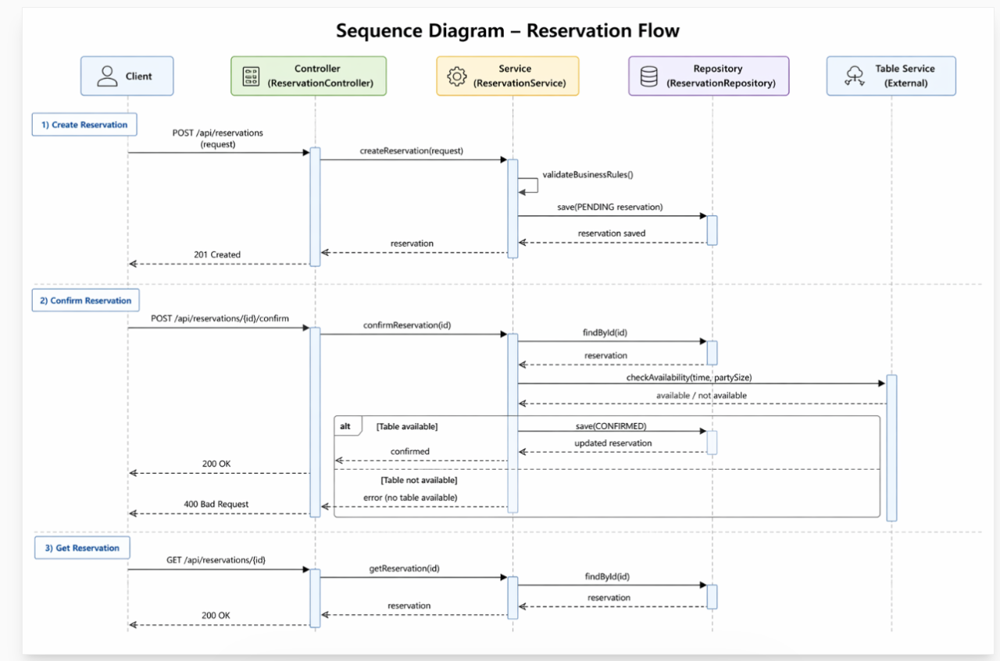

# Restaurant-Reservations



---

Later:  Client → Order Service (POST /api/reservations/{id}/confirm)
        ↳ Order Service finalizes or cancels
Where the conformation happened
Two copys of table reservation one in order service the other one in table service


# Make A Reservation (Order)

**`POST`** `http://localhost:7083/api/reservations`
###### another copy will be saved in the tabe service  in addition to order service

---

### Sample Request

```json
{
  "date": "2026-04-19",
  "time": "13:00",
  "partySize": 4,
  "customerId": "c-126"
}
```

---

| Parameter | Type | Required | Description |
|-----------|------|----------|-------------|
| **Request Body** | | | |
| `date` | `string` | Yes | Reservation date in `YYYY-MM-DD` format. e.g. `"2026-04-19"` |
| `time` | `string` | Yes | Time in `HH:MM` 24-hour format. Must be at least 30 minutes in the future. e.g. `"13:00"` |
| `partySize` | `integer` | Yes | Number of guests. Must be a positive integer. Maximum allowed party size per table is `6`. e.g. `4` |
| `customerId` | `string` | Yes | ID of the customer making the reservation. e.g. `"c-126"` |
| **Response — 201 Created** | | | |
| `id` | `string` | Response | Unique identifier for the reservation. e.g. `"2"` |
| `status` | `string` | Response | Reservation status. Always `PENDING` on creation. |
| `expiresAt` | `string` | Response | ISO 8601 expiry datetime. e.g. `"2026-04-26T11:15:00"` |
| `_links.confirm.href` | `string` | Response | URL to confirm the reservation. e.g. `"/api/reservations/2/confirm"` |
| `_links.confirm.method` | `string` | Response | HTTP method for the confirm URL. Always `"POST"` |
| **Errors** | | | |
| `400` | `Bad Request` | Error | Duplicate reservation detected for this customer, date, and time. |
| `400` | `Bad Request` | Error | Maximum allowed party size per table is `6`. |

---

### Sample Response

```json
{
  "id": "2",
  "status": "PENDING",
  "expiresAt": "2026-04-26T11:15:00",
  "_links": {
    "confirm": {
      "href": "/api/reservations/2/confirm",
      "method": "POST"
    }
  }
}
```
---
*** GET *** `http://localhost:7083/api/reservations/{id}`
###### Q) From which table?

```

{
    "customerId": "c-123",
    "reservationTime": "11:00:00",
    "reservationDate": "2026-04-26",
    "partySize": 6,
    "status": "PENDING",
    "createdAt": "2026-04-25T23:08:24.613138",
    "updatedAt": "2026-04-25T23:08:24.613139"
}
```
---

*** POST ***  `http://localhost:7083/api/reservations/8/confirm`
##### Q) Here order table has been updated the status to   CONFIRMED . How about Table service?
##### in this situatuin two copies of data will have
```
{
    "_links": {
        "confirm": {
            "href": "/api/reservations/8/cancel",
            "method": "POST"
        }
    },
    "expiresAt": "2026-04-30T22:20:04.985191",
    "id": "c-123"
}
-----------------------------------------------------------------------------------
8	| 6 | 2026-04-26 |	11:00:00 | 2026-04-25 23:08:24.613138 |	c-123 |	CONFIRMED
-----------------------------------------------------------------------------------

```

Table service


```
GET /tables/policies — expose booking policies
```
#### Elaborate on the endpoint?


*** POST ***```http://localhost:1987/api/tables/availability```


*** POST *** `/tables/reservations — create table booking`


